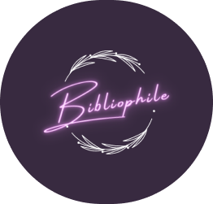
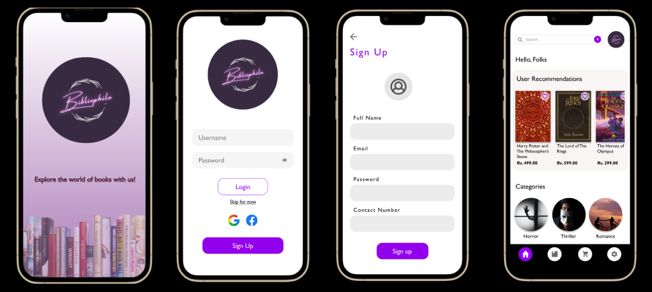
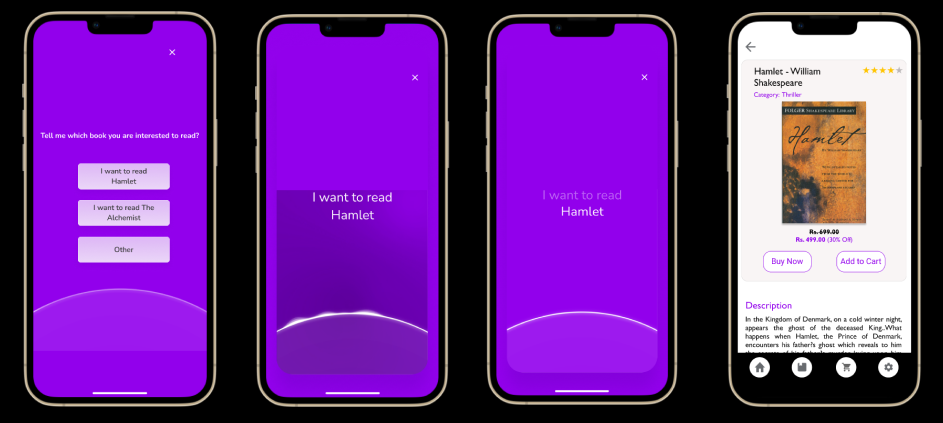
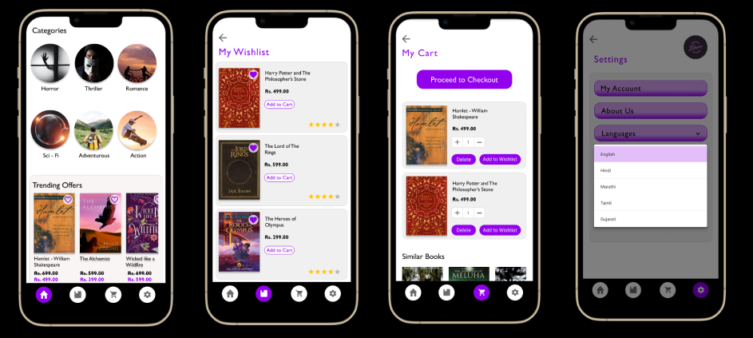

 
<h1>Bibliophile - Explore the world of Books with us !!</h1>

  Bibliophile is an online book store app, designed for book lovers to help them discover the world of books and to assist authors in selling their book. We aim to provide readers and authors with a single platform to publish, sell, purchase, read and advance their knowledge through this app. The UI/UX of this App is being designed by taking into considerations the demands of End Users and hence it consists of lot of features like:

- **Customize Search**
- **Voice over search**
- **Translation to different languages**
- **Easy in-app billing procedure**

The app exposes the user to a wide range of book genres, opening up boundless seas of information and amusement.

 

## 📓 Functionality & Concepts used

Starting from a very basic concept of Book store, a simple low-fidielty prototype was being made and then by adding additional features, considering the main aim in mind that was to make an user-friendly application, the wireframes were designed and in the above files u can see the final High-Fidelity prototype of our app.
The UI/UX of this app is made on Figma.

*Note: You have to import your files to Figma Software before accessing it.*

 

## 👀 Screenshots

## ✍ Authors

- [Himanshu Agarwal](https://github.com/himanshu-03)
- [Mahima Churi](https://github.com/Mahitej28)

 

## 📌 Features / Contributions
 - Any contributions you make are *greatly appreciated*
 - We would be glad to hear about *new features* to add in our app

 

## 🔗 Application Link & Future Scope

 - About the future scope of this app, we plan to make an actual software application based on current the UI/UX design, and to publish this application soon on various platforms.
 - Talking about the <b>High-Fidelity Prototype </b> of our Bibliophile App you can access it now from [here](https://www.figma.com/proto/ompuaD99VVCzG6eYsXCfmu/High-Fidelity-Prototype?page-id=0%3A1&node-id=2%3A14&viewport=548%2C507%2C0.3&scaling=scale-down&starting-point-node-id=2%3A2&show-proto-sidebar=1).

 

## 🪪 License

You may use this project freely at your own risk. See [LICENSE](https://choosealicense.com/licenses/mit/).

    Copyright (c) 2022 Himanshu Agarwal

<h3> Connect with me
</h3> 

     &nbsp&nbsp&nbsp
     &nbsp&nbsp&nbsp
     &nbsp&nbsp&nbsp
    &nbsp&nbsp&nbsp
    
    

 
